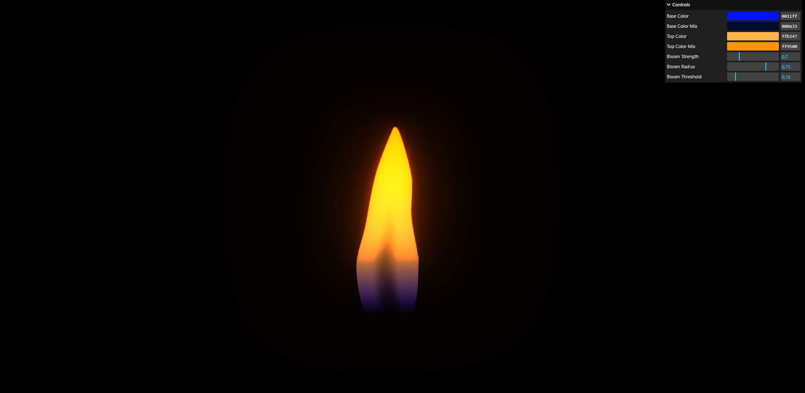
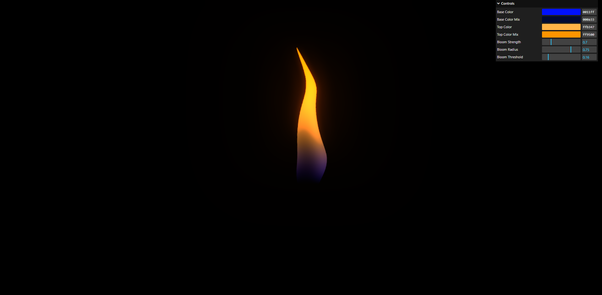
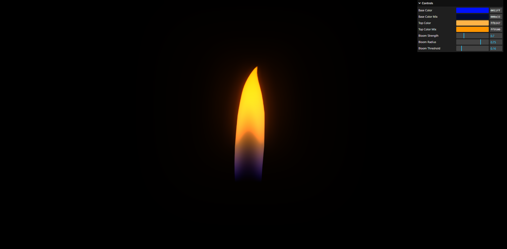

# Flame Shader
This Flame Shader was created using GLSL and showcased with Three.js.

## Demo
The project includes three different shapes, which were created from scratch.
  

## About
It is a simple shader that takes an alpha texture (three examples are available in the `static` folder) to define its shape. There is a basic wind effect and color mixing, which is enhanced by the Bloom post-processing in Three.js.
You can use the debug panel to tweak some parameters.

## Get started

### Install dependencies:
```bash
npm install
```

### Run the project:
```bash
npm run dev
```

Once the server starts, open your browser and navigate to the provided URL to see the project in action.